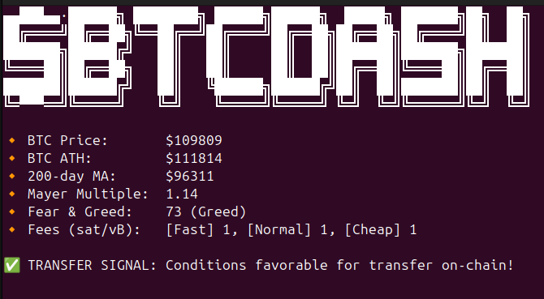

# 🟠 BTC Indexes Dashboard Script

This Python script fetches real-time Bitcoin (BTC) market data from public APIs to help identify favorable **buy** and **transfer** conditions based on:

- 🔸 **BTC Price**
- 🔸 **All-Time High (ATH)**
- 🔸 **200-Day Moving Average**
- 🔸 **Mayer Multiple**
- 🔸 **Fear & Greed Index**
- 🔸 **Transfer Fee Rates (sat/vB)**

### Terminal Screenshot


## 📦 Requirements

- Python 3.7+
- `requests`

Install dependencies (if using a virtual environment):

```bash
pip install -r requirements.txt
```

This script was developed with a **Linux environment** in mind. It should be run then in a distro or WSL.

## 🚀 Usage

Run the script:
```bash
python btc-indexes.py
```

## 🔁 Behavior

- Fetches BTC-related indexes every **30 minutes**
- Shows console output with key data and indicators
- Stores logs in `/tmp/btc_dash/YYYY-MM-DD_HH-MM.log`

## 💡 Signals

- ✅ **BUY SIGNAL**: Triggered when:
    - Mayer Multiple < 1.0
    - Fear & Greed Index ≤ 25
- ✅ **TRANSFER SIGNAL**: Triggered when:
    - halfHourFee ≤ 15 sat/vB

## 🧹 Logging

Log files are automatically saved in:
```bash
/tmp/btc_dash/
```
Each execution clears and creates a new log file.

## ⌨️ Exit

Press **Ctrl + C** to stop the script safely.

## 📁 Project Structure

```bash
btc-indexes.py        # Main script
README.md             # This file
.gitignore            # Git ignore file
requirements.txt      # Optional pip deps
```

## 🔐 Disclaimer

This tool is for informational purposes only and should not be considered financial advice.